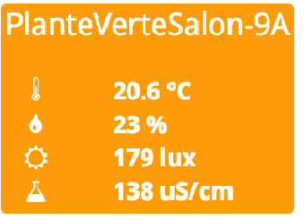

     

### Master:   

### Develop:   

# Présentation:

Plugin permettant de récupérer les informations des Xiaomi Plants ou MiFlora.

Les Xiaomi Plants sont des sticks Bluetooth de la marque Xiaomi permettant de mesurer l’hygrométrie, la température, la lumière, l’engrais d’une plante. Nul besoin d’autre chose qu’une connexion Bluetooth, y compris via un appareil déporté.

# Documentation du plugin:
 
[présentation](docs/fr_FR/presentation.md) [configuration](docs/fr_FR/configuration.md) [faq](docs/fr_FR/faq.md) [changelog](docs/fr_FR/changelog.md)

# Documentation complète:

