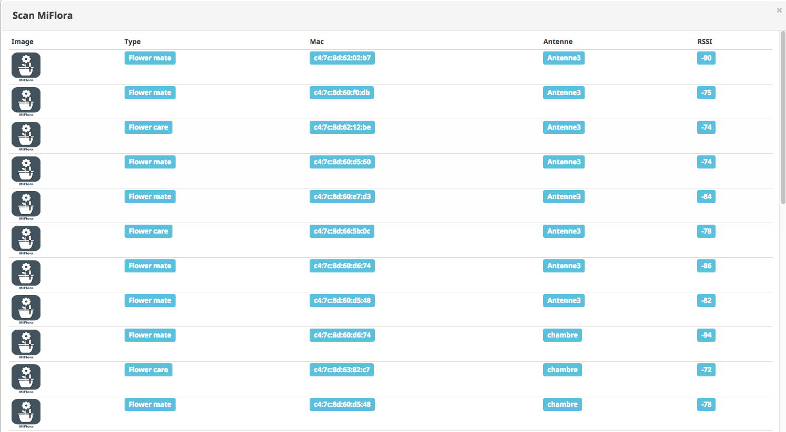

#Lancer le Scan
Cet écran permet de visualiser l'ensemble des équipement MiFlora actifs en Bluetoth et qui ne sont pas définis comme des équipements dans le plugin
cela permet entre autre de récupérer les mac adresse pour la fonction Ajouter

il se présente de la façon suivante 

##Type
Donne le type de Miflora (remontée par l'équipement lors du scan) les équipements bluetooth qui ne sont ni des MiFlora ni des Parrots sont pas affichés
##Mac
Indique la mac adresse de l'équipement détecté (les équipements déja déclarés ne sont pas affichés )
##Antenne
Indique l'antenne qui a détecté l'équipement
remarque: on peut retrouver le même équipement détecté par des antennes différentes c'est normal
cela permet de choisir l'antenne qui a la meilleure réception
##RSSI
indique la puissance du signal de réception plus le chiffre est petit moins le signa est bon (donc un signal a -75 est meilleur qu'un signal à -96)

Attention: la majorité des plugins Bluetooth monopolisent le controleur, le scan ne trouvent aucune antenne quand un autre plugin bloque le controleur. Pour avoir un resultat fiable il faut dédier un 'adaptateur Bluetooth' à MiFlora, celui integré à un raspberry PI ou un dongle par exemple.
