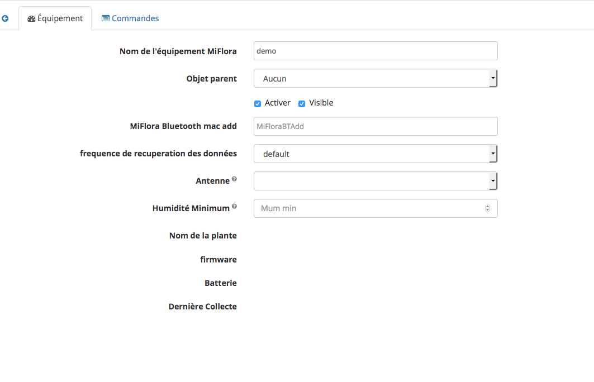

# Ajouter
Cet écran permet l'ajout d'équipement Miflora. Il se présente de la façon suivante :

### Nom de l'équipement MiFlora
Ce champ est saisi lors du lancement de la fonction. Il peut être modifié par la suite si on le souhaite 
### Objet parent
Ratache l'équipement à un objet Jeedom
### Activer Visible
Active et/ou rend visible/invisible l'équipement
### Miflora Bluetooth mac add
Champ obligatoire il doit contenir la mac adresse de l'équipement.
Cette mac adresse peut etre obtenue via l'écran de Scan (voir plus bas)
### fréquence de récupération des données 
Permet de fixer une valeur différente de la valeur par défaut du plugin pour cet équipement spécifiquement
### Antenne
Permet de définir quel controleur bluetooth va collecter les donées de l'équipement 
les valeurs suivantes sont possibles
#### local
Permet d'indiquer que c'est le controleur local de Jeedom (voir configuration) qui sera utilisé
#### Auto
Permet de laisser le plugin choisir l'antenne la plus adaptée à la collecte.
Pour ce faire toutes les heures le plugin va scanner le réseau sur tous les controleurs disponnible (Local et remote )
Pour chaque équipement défini en mode automatique l'antenne avec le signal Bluetooth le plus fort sera choisie.
#### (choix des remotes)
les choix suivants correspondent aux différentes antennes qui ont été définie dans ce cas seule cette antenne sera utilisée pour les collectes 
### Humidité Minimum
Permet de définir un seuil d'alerte pour l'humidité minimum de l'équipement.
Si la valeur de l'humidité est inférieure à cette valeur alors la commande HumMin est positionnée a 1 (ce qui permet de déclancher des scénario etc ...)
Attention la mesure n'est faite que lors des collectes il ne s'agit pas d'une mesure "temps réel" 
### Nom de la plante, Firmware, Batterie, dernière collecte et Type d'objet
Ces champs sont remplis lors des collectes 
