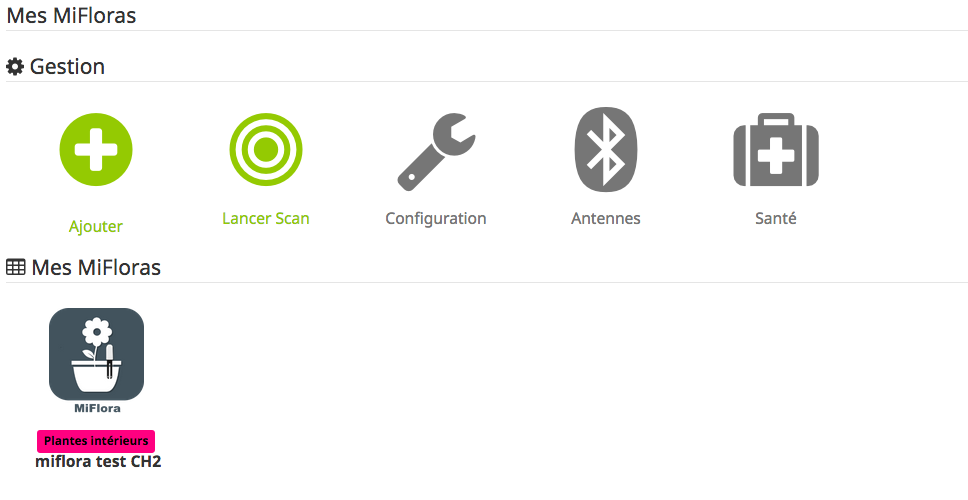

# Ecran général du plugin
L'écran principal du plugin ce présente de la façon suivante :

### Ajouter
Permet l'ajout d'un nouvel équipement
### Lancer Scan
Permet de lancer une recherche des équipement MiFlora présent en Bluetooth mais pas encore présent dans Jeedom
### Configuration
Permet la configuration générale du plugin
### Antennes
Permet de définir des antennes distantes pour collecter les données des équipements 
### Santé
Permet d'avoir une vision globale du fonctionnement du plugin et de tous les équipements  
