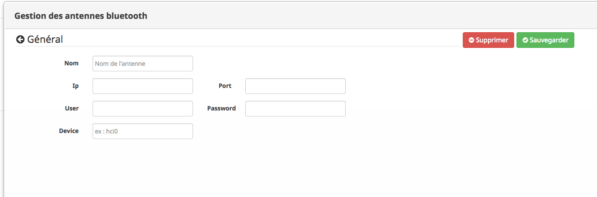

# Antennes distantes
### Description

Cette page permet la récupération des données des équipements distants via des antennes déportées 

Peuvent être utilisé comme antenne toute machine linux sur laquelle la commande `gatttool` fonctionne et sur laquelle le ssh est possible.

Les Xiaomi Plants sont des sticks Bluetooth de la marque Xiaomi permettant de mesurer l'hygrométrie, la température, la lumière, l'engrais d'une plante. Nul besoin d'autre chose qu'une connexion Bluetooth, y compris via un appareil déporté.

### Ecran de base

L'écran de base ce présente comme ceci

### ajout d'une antenne

L'écran ce présente comme ceci

#### nom
indique le nom de l'antenne

#### ip
indique l'adresse ip de l'antenne distante 

#### User
indique le nom du user qui sera utilisé pour lancer les commandes distante (attention ce user doit disposer du droit de lancer des commandes sudo)

#### Password
indique le mot de passe du compte 'User'

#### port
indique le port pour la commande ssh (en général port = 22)

#### Device
indique le nom du device bluetooth qui sera utilisé sur la machine distante 
(valeures possibles de hci0 a hci3 )
