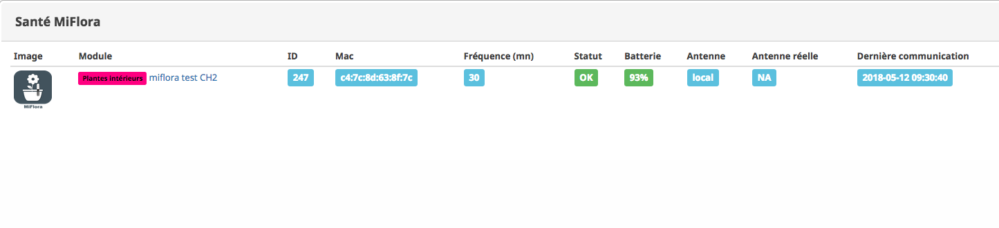

# Santé
Cet écran permet de visualiser l'état du plugin et des équipements

il se présente de la façon suivante 

### Image
L'icone sera grisé si l'équipement n'est pas activé (voir écran d ajout)
### Module
Donne les informations sur l'équipement (objet et nom)
### id
Indique l'ID Jeedom interne
### Mac
Indique la mac adresse de l'équipement 
### Fréquence mini
indique la fréquence de collecte des données (permet de voir si l'équipement utilise la valeur par default ou une valeur specifique )
### Status
en vert indique que la derniere collecte s'est bien déroulée en rouge indique qu'il y a eu une erreur lors du dernier essai de collecte 
### Batterie
Donne l'état de la pile de l'équipement
### Antenne
indique quelle antenne à été indiquée dans la configuration de l équipement (_local, Auto, nom de l'antenne deportée_)
### Antenne réelle
Indique si la configuration de l'antenne est à _Auto_ l'antenne la plus puissante qui a été trouvée et qui est utilisée
### derniere collecte
Indique la date et l'heure de la derniere collecte de donnée
